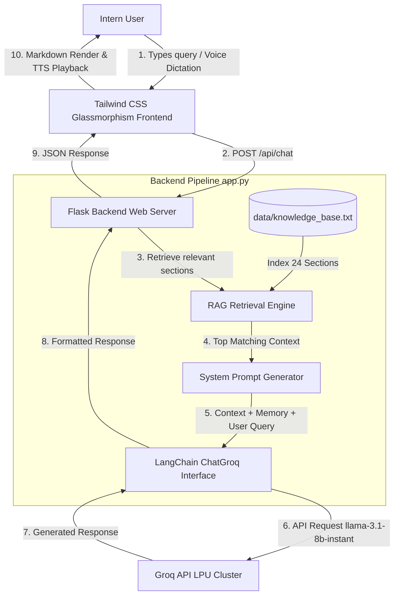

# 🤖 InterneeBot - GenAI Chatbot for Intern Queries

[](https://www.python.org/)
[](https://flask.palletsprojects.com/)
[](https://www.langchain.com/)
[](https://groq.com/)
[](https://tailwindcss.com/)
[](LICENSE)

> An intelligent, production-ready **GenAI Assistant & Virtual Mentor** built for **Internee.pk** interns. Powered by **Flask**, **LangChain**, **Groq API (`llama-3.1-8b-instant`)**, local **RAG Knowledge Retrieval**, and an ultra-sleek **Light-Mode Glassmorphism UI**.

---

## 📌 Problem Statement

Interns at virtual platforms like **Internee.pk** often face recurring challenges and blockers:
1. **Support Bottlenecks:** High volume of repetitive questions regarding task submission rules, repository naming conventions, and portal workflows.
2. **Delayed Responses:** Manual mentor resolution on Discord or WhatsApp can take hours or days, causing missed task deadlines.
3. **Complex Submission Guidelines:** Requirements (GitHub repository structure, mandatory LinkedIn tagging `@Internee.pk`, video demo posts, LMS links) are frequently fragmented across multiple portals.
4. **Certificate & LOR Ambiguity:** Interns struggle to track exact criteria for completion certificates (70%+ passing benchmark) vs. Letters of Recommendation (90%+ average score).

---

##💡 The Solution: InterneeBot

**InterneeBot** solves these friction points by providing a 24/7 autonomous GenAI mentor assistant:
- **Instant Answers:** Ultra-fast sub-second responses powered by Groq's LPUs and `llama-3.1-8b-instant`.
- **RAG Architecture:** Grounded strictly in official Internee.pk knowledge base documents (`data/knowledge_base.txt`), ensuring zero hallucinations and 100% accurate policy guidance.
- **Interactive Intern Productivity Tools:**
  - 📋 **Domain Task Submission Checklist Generator:** Auto-generates interactive step-by-step checklists for Web Dev, AI, Data Science, Cyber Security, etc.
  - 📖 **Knowledge Index Browser:** One-click modal to browse official policies, LOR criteria, and evaluation benchmarks.
  - 🎫 **Support Ticket Formatter:** Helps interns draft structured tickets for human mentor escalation when needed.
  - 🚀 **Direct Task Portal Link:** 1-click launcher for `https://lms.internee.pk`.
---

## 🏗️ System Architecture & Workflow Diagram



---

## 🎨 UI/UX Design System (Inspired by Modern Dribbble Tech Landing Pages)

- **Light-Mode Glassmorphism:** Semi-transparent frosted glass containers (`backdrop-blur-2xl`, `bg-white/80`, `border border-slate-200/70`, `shadow-2xl`).
- **Ambient Radial Gradients:** Vibrant indigo, violet, and purple soft background glows (`bg-gradient-to-r from-violet-600 to-indigo-600`).
- **Typography:** Built using Google Fonts **Plus Jakarta Sans** & **Inter** (the modern design standards used by Vercel, OpenAI, and Figma).
- **Interactive Elements:**
  - 🔮 3D Floating Glowing Orb welcome state when starting new conversations.
  - 💬 Code block syntax highlighting with Highlight.js and 1-click copy buttons.
  - 🔊 Text-to-Speech (read response aloud) & 🎙️ Speech-to-Text voice dictation.

---

## 🛠️ Technology Stack

| Layer | Technology | Purpose |
| :--- | :--- | :--- |
| **Backend Framework** | **Python 3.10+ / Flask** | REST API web server handling chat endpoints and static template rendering |
| **LLM Inference** | **Groq API (`llama-3.1-8b-instant`)** | Ultra-fast, zero-cost natural language reasoning and query synthesis |
| **Orchestration** | **LangChain (`langchain-groq`)** | System prompt engineering, conversation memory, and model invocation |
| **Retrieval (RAG)** | **TF-IDF & Vector Retriever Engine** | Sections chunking and similarity search over `data/knowledge_base.txt` |
| **Frontend Framework** | **HTML5 / Tailwind CSS (CDN)** | Glassmorphic design system, animations, responsive layouts |
| **Typography** | **Plus Jakarta Sans & Inter** | Modern, sleek, professional UI typography |
| **Client Utilities** | **Marked.js, Highlight.js, Lucide Icons** | Markdown parsing, code syntax highlighting, modern icons |
| **Environment** | **`python-dotenv`** | Secure localized `.env` environment variable management |

---

## 📂 Project File Structure

```
InterneeBot-GenAI-Assistant-project-3/
├── app.py                      # Flask backend API, RAG indexer & Groq LangChain pipeline
├── data/
│   └── knowledge_base.txt      # Official Internee.pk knowledge base, guidelines, & FAQs
├── templates/
│   └── index.html              # Tailwind CSS light-mode glassmorphic frontend UI
├── .env                        # Local environment variables (contains GROQ_API_KEY)
├── .env.example                # Template file for environment configuration
├── .gitignore                  # Excludes .env, virtualenv, cache, and logs
├── requirements.txt            # Python dependencies (Flask, LangChain, Groq, etc.)
├── DOCUMENTATION.md            # Technical architecture breakdown & system documentation
└── README.md                   # Project overview & documentation
```

---

## 🚀 Quickstart & Installation Guide

### Prerequisites
- Python 3.10 or higher installed.
- A free **Groq API Key** (Get one at [https://console.groq.com](https://console.groq.com)).

### 1. Clone the Repository
```bash
git clone https://github.com/itsayeshaqamar/InterneeBot-GenAI-Assistant-project-3.git
cd InterneeBot-GenAI-Assistant-project-3
```

### 2. Set Up Environment Variables
Create a `.env` file in the project root directory (or copy from `.env.example`):
```bash
cp .env.example .env
```
Edit `.env` and paste your Groq API key:
```env
GROQ_API_KEY=gsk_your_groq_api_key_here
PORT=5000
```

### 3. Create & Activate Virtual Environment
```bash
# On Windows (PowerShell)
python -m venv venv
.\venv\Scripts\Activate.ps1

# On Linux / macOS
python3 -m venv venv
source venv/bin/activate
```

### 4. Install Dependencies
```bash
pip install -r requirements.txt
```

### 5. Run the Application
```bash
python app.py
```

Open your browser and navigate to:
👉 **`http://127.0.0.1:5000`**

---

## 🔗 REST API Endpoints Reference

| Endpoint | Method | Description | Sample Request / Response |
| :--- | :--- | :--- | :--- |
| `GET /` | `GET` | Renders the main glassmorphic Chat UI | Renders `templates/index.html` |
| `GET /api/status` | `GET` | Returns system diagnostic & RAG index status | `{"status": "online", "model": "llama-3.1-8b-instant", "rag_status": {"loaded": true, "total_chunks": 24}}` |
| `GET /api/quick-topics` | `GET` | Fetches pre-configured quick prompt cards | Returns array of topics (Submissions, Certificates, Extensions, Stipends) |
| `POST /api/chat` | `POST` | Accepts user message, performs RAG search, and invokes Groq LLM | **Payload:** `{"message": "How do I submit tasks?"}`<br>**Response:** `{"response": "...", "model": "llama-3.1-8b-instant"}` |
| `POST /api/checklist` | `POST` | Generates domain-specific submission checklist | **Payload:** `{"domain": "Web Development", "task_number": "1"}`<br>**Response:** Structured steps checklist |

---

## 🤝 Contributing & License

Contributions, feature requests, and feedback are welcome!
Distributed under the **MIT License**.

---

**Built with ❤️ for Internee.pk Interns**
